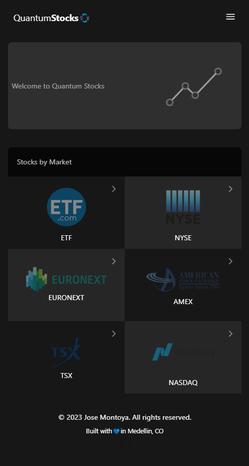
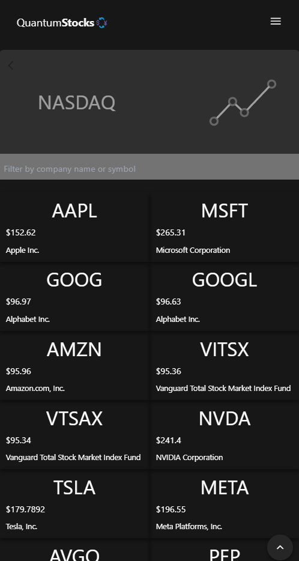

<a name="readme-top"></a>

<div align="center">
   <h1><b>Quantum Stocks</b></h1>
  
  
</div>

<!-- TABLE OF CONTENTS -->

# 📗 Table of Contents

- [📖 About the Project](#about-project)
  - [🛠 Built With](#built-with)
    - [Tech Stack](#tech-stack)
    - [Key Features](#key-features)
  - [🚀 Live Demo](#live-demo)
- [💻 Getting Started](#getting-started)
  - [Setup](#setup)
  - [Prerequisites](#prerequisites)
  - [Install](#install)
  - [Usage](#usage)
  - [Run tests](#run-tests)
  - [Deployment](#triangular_flag_on_post-deployment)
- [👥 Authors](#authors)
- [🔭 Future Features](#future-features)
- [🤝 Contributing](#contributing)
- [⭐️ Show your support](#support)
- [🙏 Acknowledgements](#acknowledgements)
- [❓ FAQ (OPTIONAL)](#faq)
- [📝 License](#license)

<!-- PROJECT DESCRIPTION -->

# 📖 Quantum Stocks <a name="about-project"></a>

**Quantum Stocks** is a web application where you can visualize detailed information about any stock traded in the six biggest markets.

## 🛠 Built With <a name="built-with"></a>

### Tech Stack <a name="tech-stack"></a>

<details>
  <summary>Client</summary>
  <ul>
    <li><a href="https://reactjs.org/">React</a> to create the UI.</li>
    <li><a href="https://redux-toolkit.js.org/">Redux Toolkit</a> to manage state.</li>
    <li><a href="https://tailwindcss.com/">Tailwindcss</a> to apply awesome styles.</li>
  </ul>
</details>

<details>
  <summary>Server</summary>
  <ul>
    <li><a href="https://site.financialmodelingprep.com/developer/docs/">Financial Modeling Prep API</a></li>
  </ul>
</details>

<details>
<summary>Database</summary>
  <ul>
    <li>N/A</li>
  </ul>
</details>

<!-- Features -->

### Key Features <a name="key-features"></a>

- **Users can filter stocks for specific market.**
- **Users can filter stocks using name or symbol.**
- **Users can see detailed information about any stock.**
- **The application is fully responsive.**

<p align="right">(<a href="#readme-top">back to top</a>)</p>

<!-- LIVE DEMO -->

## 🚀 Live Demo <a name="live-demo"></a>

- [Live Demo](https://stock-viewer.onrender.com/)

<p align="right">(<a href="#readme-top">back to top</a>)</p>

<!-- GETTING STARTED -->

## 💻 Getting Started <a name="getting-started"></a>

To get a local copy of this project and run it in your computer, follow these steps.

### Prerequisites

In order to run this project you need:
- A working computer.
- Connection to internet.
- [npm](https://www.npmjs.com/) and [Node.js](https://nodejs.org/en/) installed, if you don't have them, please follow this [simple installation guide](https://docs.npmjs.com/downloading-and-installing-node-js-and-npm).

### Setup

To get a local copy up and running follow these simple example steps.

Clone this repository in the desired folder:
```
cd my-folder
git clone https://github.com/jmonto55/Stock-Viewer.git
```

### Install

To install this project:
```
cd Stock-Viewer
code .
npm install
```

### Usage

To run the project, execute the following command:

```
npm start
```

### Run Tests

To run the project tests, execute the following command:

```
npm test
```

<p align="right">(<a href="#readme-top">back to top</a>)</p>

<!-- AUTHORS -->

## 👥 Authors <a name="authors"></a>

👤 **Jose Montoya**

- GitHub: [@jmonto55](https://github.com/jmonto55)


<p align="right">(<a href="#readme-top">back to top</a>)</p>

<!-- FUTURE FEATURES -->

## 🔭 Future Features <a name="future-features"></a>

- [ ] **Corrections spotted by reviewer will be implemented**

<p align="right">(<a href="#readme-top">back to top</a>)</p>

<!-- CONTRIBUTING -->

## 🤝 Contributing <a name="contributing"></a>

Contributions, issues, and feature requests are welcome!

Feel free to check the [issues page](../../issues/).

<p align="right">(<a href="#readme-top">back to top</a>)</p>

<!-- SUPPORT -->

## ⭐️ Show your support <a name="support"></a>

If you like this project feel free to frok it and use it as you need.

<p align="right">(<a href="#readme-top">back to top</a>)</p>

<!-- ACKNOWLEDGEMENTS -->

## 🙏 Acknowledgments <a name="acknowledgements"></a>

I would like to thank **Nelson Sakwa** for the design

- Behance: [@sakwadesignstudio](https://www.behance.net/sakwadesignstudio)

<p align="right">(<a href="#readme-top">back to top</a>)</p>

<!-- FAQ (optional) -->

## ❓ FAQ (OPTIONAL) <a name="faq"></a>

- **Can I use the project for any purpose?**

  - Yes, you can use this files for anything you need.

- **Is the information saved in any database?**

  - No, all data is fetched from API.

<p align="right">(<a href="#readme-top">back to top</a>)</p>

<!-- LICENSE -->

## 📝 License <a name="license"></a>

This project is [MIT](./LICENSE) licensed.


<p align="right">(<a href="#readme-top">back to top</a>)</p>
